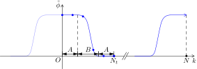

WDM Wavelet Transform
=====================

Wilson-Daubechies-Meyer wavelets are variation on the Gabor scheme and they form orthonormal bases of :math:`L^2(\mathbb{R})`. 
The merit of WDM wavelets is that it ensures exponential decay on both time and frequency domain. It was first proposd in this
`article <https://inspirehep.net/literature/329218>`_. Here, I would like to introduce the discretized version directly.

Bases generation
----------------

Suppose that there is a sampling sequence with length :math:`N`:

.. math::
    x[j],\quad j=1,\,2,\,\cdots,\, N-1.

We want to expand it with orthonomal basis :math:`\Psi_{mn}`:

.. math::
    x[j]=\sum_{mn}w_{mn}\Psi_{mn}[j],

Just like *short time Fourier transform*, I will devide the sequence into segments. Let :math:`N=N_fN_t`, where :math:`N_f` and :math:`N_t` are integers.
Futhermore, I only handle case where :math:`N_f` is even.

.. attention::
    WDM wavelet transform is well defined even if :math:`N_f` is odd. However, fractional interpolation is needed to define something like :math:`\phi[j+1/2]`.

The bases :math:`\Psi_{mn}` are determined by a kernel :math:`\phi`, which is real and even. To understand the process, 
generating a set of auxiliary functions :math:`\psi_{mn}\;(m>0,\,n\geq0)` firstly:

.. math::
    :label: eq:definePsi

    \begin{gathered}
    \tilde{\psi}_{10}[k] = \tilde{\phi}[k], \quad \psi_{mn}[j] = \psi_{m0}[j-nN_f],\\
    n = 0,\,1,\,\cdots,\,N_t-1.
    \end{gathered}

.. note::
    Quantity with *tilde* is obtained by adopting discrete Fourier transform (DFT). The convention of DFT is the same as ``numpy`` "ortho".

We see that the significance of :math:`n` is time shifting. But in :eq:`eq:definePsi`, I have not defined :math:`\psi_{m0}` when :math:`m>1`. In fact,
the parity of :math:`m` plays a role. Let :math:`m=2l+\kappa`:  

.. math::
    :label: eq:defpsi

    \begin{gathered}
    \tilde{\psi}_{2l+\kappa,0}[k]=\frac1{\sqrt{2}} \left\{\tilde{\phi}[k-lN_t] + (-1)^{l+\kappa} \tilde{\phi}[k+lN_t]\right\}\mathrm{e}^{-\mathrm{i}\mathrm{\pi}\kappa k/N_t},\\
    l = 1,\,2,\cdots,\,N_f/2-1,\quad \kappa = 0,\,1.
    \end{gathered}

Because we are dealing with finite sequence, circulant condition is adopted (:math:`x[j]=x[j+N]`). To expand a series with :math:`N` elements, :math:`N` bases are needed.
Until now, I have constructed :math:`2N_t(N_f/2-1)=N-N_t` bases. To generate the remaining, a tentative operation is to take :math:`l=N_f/2` in eq. :eq:`eq:defpsi`. 
But this time :math:`\tilde{\phi}[k-lN_t]=\tilde{\phi}[k+lN_t]`. Null result is obtained if parity of :math:`l` and :math:`\kappa` differs.
In fact, The correct definition is

.. math::
    \tilde{\psi}_{N_f,0} = \tilde{\phi}[k-N_fN_t/2]\mathrm{e}^{-\mathrm{i\pi}\kappa k / N_t},\quad \kappa = \frac{N_f}2\bmod 2.

Orthonormal condition
---------------------

:math:`\left\{\psi_{mn}\right\}` should satisfy certain condition. That is, 
:math:`\Vert \psi_{mn} \Vert = 1`. And for any :math:`g,\,h\in\mathbb{C}^N`,

.. math::
    :label: eq:orthocond

    \sum_{mn}\langle g,\,\psi_{mn}\rangle\langle \psi_{mn},\,h\rangle = \langle g,\,h\rangle

The left side is (using Parseval's identity)

.. math::
    :label: eq:orthoderive

    \sum_{m=1}^{N_f+1}\sum_{n=0}^{N_t-1}\sum_{k=0}^{N-1}\sum_{k^\prime=0}^{N-1} & \tilde{g}^*[k]\tilde{h}[k^\prime] \tilde{\psi}_{mn}[k]\tilde{\psi}^*_{mn}[k^\prime] 

    &=\sum_{m=1}^{N_f+1}\sum_{k=0}^{N-1}\sum_{k^\prime=0}^{N-1}\tilde{g}^*[k]\tilde{h}[k^\prime]\tilde{\psi}_{m0}[k]\tilde{\psi}^*_{m0}[k^\prime]\sum_{n=0}^{N_t-1}
    \mathrm{e}^{\mathrm{i}2\mathrm{\pi}n(k^\prime-k)/N_t},

    &= N_t\sum_a\sum_{k=0}^{N-1}\tilde{g}^*[k]\tilde{h}[k+aN_t] \sum_{m=1}^{N_f+1}\tilde{\psi}_{m0}[k]\tilde{\psi}^*_{m0}[k+aN_t].

I have used

.. math::
    \sum_{n=0}^{N_t-1}\mathrm{e}^{\mathrm{i}2\mathrm{\pi}n(k^\prime-k)/N_t} = N_t\sum_{a=-\infty}^{\infty}\delta[k^\prime-k-aN_t]

in the above derivation. It is also convenient to
define circulant *Dirac delta* as follows:

.. math::
    \delta_N[j]:=\sum_{a=-\infty}^{\infty}\delta[j-aN].

To keep eq. :eq:`eq:orthocond` satisfied, we have

.. math::
    :label: eq:psicond

    \sum_{m=1}^{N_f+1}\tilde{\psi}_{m0}[k]\tilde{\psi}^*_{m0}[k+aN_t] = \frac1{N_t}\delta_{N_f}[a].

This is the condition we find on the bases. But we also want to understand the implication on the kernel :math:`\phi`. Substitute the left side:

.. math::

    \sum_{m=1}^{N_f+1}\tilde{\psi}_{m0}[k] & \tilde{\psi}^*_{m0}[k+aN_t] 
    
    &= \tilde{\phi}[k]\tilde{\phi}[k+aN_t] +\frac12\sum_{l=1}^{N_f/2-1}\sum_{\kappa=0}^1\left\{\tilde{\phi}[k-lN_t]+(-1)^{l+\kappa}\tilde{\phi}[k+lN_t]\right\}\times

    &\phantom{==}  \left\{\tilde{\phi}[k-lN_t+aN_t]+(-1)^{l+\kappa}\tilde{\phi}[k+lN_t+aN_t]\right\}\mathrm{e}^{\mathrm{i}\mathrm{\pi}\kappa a} +
    
    &\phantom{==} \left.\tilde{\phi}[k-lN_t]\tilde{\phi}[k-lN_t+aN_t]\mathrm{e}^{\mathrm{i\pi}\kappa a}\right|_{l=N_f/2,\,\kappa=l\bmod2}
    
    &= \tilde{\phi}[k]\tilde{\phi}[k+aN_t] +  \sum_{l\neq0}^{|l|=N_f/2-1}\tilde{\phi}[k+lN_t]\tilde{\phi}[k+(l+a)N_t]\frac12[1+(-1)^a] +

    &\phantom{==} \sum_{l\neq0}^{|l|=N_f/2-1}(-1)^l\tilde{\phi}[k+lN_t]\tilde{\phi}[k+(-l+a)N_t]\frac12[1-(-1)^a] +

    &\phantom{==} \left.\tilde{\phi}[k-lN_t]\tilde{\phi}[k-lN_t+aN_t]\mathrm{e}^{\mathrm{i\pi}\kappa a}\right|_{l=N_f/2,\,\kappa=l\bmod2}

If :math:`a` is odd (:math:`a=2b+1`), eq. :eq:`eq:psicond` is equivalent to

.. math::
    \sum_{l=0}^{N_f-1}(-1)^l\tilde{\phi}[k+lN_t]\tilde{\phi}[k+(-l+2b+1)N_t]=0.

.. note::
    Shifting :math:`l` is valid because the summation is circulant. For the convenience of discussion, 
    index span one cycle is expressed in multiple ways.

This condition is automatically satisfied (hence on constraint on :math:`phi`), as is easily shown by a substitute of summation index :math:`l^\prime=-l+2b+1`:

.. math::
    \sum_{l=0}^{N_f-1}(-1)^l\tilde{\phi}[k+lN_t]\tilde{\phi}[k+(-l+2b+1)N_t] = -\sum_{l^\prime=0}^{N_f-1}(-1)^{l^\prime}\tilde{\phi}[k+(-l^\prime+2b+1)N_t]
    \tilde{\phi}[k+l^\prime N_t]

Hence, we turn to consider :math:`a` even (:math:`a=2b`) case and an important formula emerges:

.. math::
    :label: eq:phiorthocond

    \color{OrangeRed}
    \sum_{l=0}^{N_f-1}\tilde{\phi}[k+lN_t]\tilde{\phi}[k+(l+2b)N_t] = \frac1{N_t}\delta_{N_f}[2b].

Interestingly, condition :eq:`eq:phiorthocond` can cover :math:`\Vert\psi_{mn}\Vert=1`.
It is suffice to prove :math:`\sum_{k=0}^{N-1}\tilde{\psi}_{m0}[k]\tilde{\psi}^*_{m0}[k]=1`, 
which is

.. math::
    \frac12\sum_{k=0}^{N-1}\left|\tilde{\phi}[k-lN_t]+(-1)^{l+\kappa}\tilde{\phi}[k+lN_t]\right|^2=\sum_{k=0}^{N-1}\tilde{\phi}^2[k]+
    (-1)^{l+\kappa}\sum_{k=0}^{N-1}\tilde{\phi}[k-lN_t]\tilde{\phi}[k+lN_t]=1.

This is equivalent to

.. math::
    \sum_{k=0}^{N-1}\tilde{\phi}[k]\tilde{\phi}[k+2lN_t]=\delta_{N_f}[2l].

The left side is

.. math::
    \sum_{l^\prime=0}^{N_f-1}\sum_{k=0}^{N_t-1}\tilde{\phi}[k+l^\prime N_t]\tilde{\phi}[k+(l^\prime+2l)N_t].

In eq. :eq:`eq:phiorthocond`, taking :math:`b=l` and proof is completed.

Meyer kernel
------------

Condition :eq:`eq:phiorthocond` is greatly simplified for a kind of kernel which is only nonzero at :math:`k = -N_t,\,\cdots,\,0,\,1,\,\cdots,\,N_t-1`:

.. math::
    :label: eq:simphiorthocond

    \tilde{\phi}^2[k] + \tilde{\phi}^2[N_t-k]=\frac1{N_t}\,\qquad k=0,\,1,\,\cdots,\, N_t-1. 

Meyer kernel (frequency domain) is a window function:

.. math::
    \tilde{\phi}[k] = \begin{cases}
    \frac{1}{\sqrt{N_t}}\qquad &|k| < A, \\
    \frac{1}{\sqrt{N_t}}\cos\left[\frac\pi2 B_\nu\left(\frac{|k|-A}{B}\right)\right]\qquad &A\leq|k|\leq A+B, \\
    0\qquad &\text{otherwise}.
    \end{cases}

Where :math:`2A+B=N_t`. :math:`B_\nu` is regularized incomplete Beta function:

.. math::
    B_\nu(x) =\frac{\int_0^x t^{\nu-1}(1-t)^{\nu-1}\,\mathrm{d}t}{\int_0^1 t^{\nu-1}(1-t)^{\nu-1}\,\mathrm{d}t}.

This formalism ensures eq. :eq:`eq:simphiorthocond`.

An conprehensive illustration of Meyer kernel.

    

Relabel
-------
A more concise form can be obtain by recombining indexes. That is 

.. math::
    \mathfrak{m}=0&:\qquad \Psi_\mathfrak{mn}=\psi_{1n}\quad (\mathfrak{n}=n),
    
    1\leq \mathfrak{m} \leq N_f/2&:\qquad \Psi_\mathfrak{mn}=\psi_{2l+\kappa,n}\quad (\mathfrak{m}=l,\;\mathfrak{n}=2n+\kappa).

From now on, I will bury the auxiliary functions. So, Gohic indexes are not used to differ each other any more
(I hope that you are not confused by the tricky relabeling process). Do inverse Fourier transform and the bases in time domain are

.. math::
    \begin{gather}
    \Psi_{mn}[j]=A(-1)^{mn}\phi[j-n\frac{N_f}2]\begin{cases}\cos\left(2\pi j\frac{m}{N_f}\right)
    \quad n+m\; \text{even},\\ \sin\left(2\pi j\frac{m}{N_f}\right) \quad n+m\; \text{odd}.\end{cases}\\
    n = 0,\,1,\,\cdots,\,2N_t-1,\\
    m = 0,\,1,\,\cdots,\,N_f/2,\\
    A=1 \qquad \text{if}\; m=0, \,N_f/2 \quad \text{else} \;\sqrt{2}.
    \end{gather}

The bases in frequency domain are    

.. math::
    \begin{gather}
    \tilde{\Psi}_{mn}[k] = \frac{A}{2}\mathrm{e}^{-\mathrm{i}\pi nk/N_t} \begin{cases}
    \left(\tilde{\phi}[k-m N_t]+\tilde{\phi}[k+m N_t]\right) &\quad n+m\; \text{even},\\
    (-\mathrm{i})\left(\tilde{\phi}[k-m N_t]-\tilde{\phi}[k+m N_t]\right)   &\quad n+m\; \text{odd}.\\ 
    \end{cases}
    \end{gather}

This formula also expresses null results naturally.

